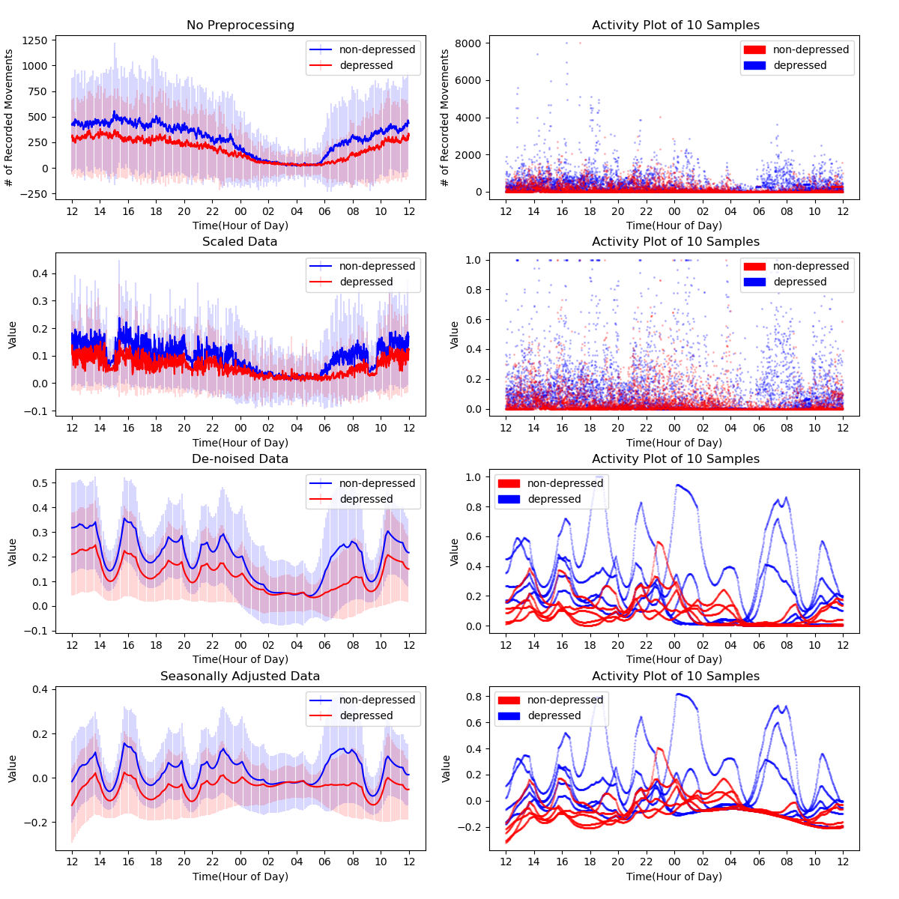
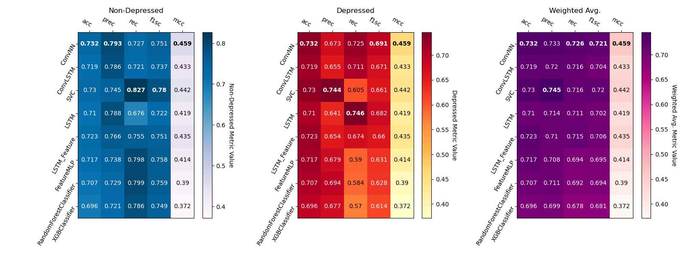

# Machine Learning for Detecting Depression from Motion Data

This repo contains all the machine learning pipelines and code I wrote in Python for rapid experimentation of various machine learning models and preprocessing techniques. I learned so much through this project, and if you want the details and a couple figures, I've explained it all as best as I can.

TODO:

- Results Charts
- Writing ReadME.md

### The Short Version

This project is about relationship between physical movement patterns and depression, and trying to detect this with machine learning. The dataset, called Depresjon, contains motion data from 55 subjects-- some depressed, some non-depressed(Enrique et al). This time-series dataset was challenging to work with because it is small, imbalanced, and full of noise.

After confirming that there is at least _some_ difference between the classes in the data so I'm not completely wasting my time, I...

1. Split the data
2. Preprocessed data using various techniques for model input
3. Trained several models on the data
4. Evaluated their respective performances

In the end, I was able to beat the Depresjon paper's results, improving on multiple key metrics. Though there may still be room for improvement, I've tinkered with this project for way too long so I'm leaving it at that :).

Future work could involve exploring addiional features for the data or to develop a lightweight application where users can upload their own data and figure out their likelihood of having depression based on the best performing model.

## Repo Guide

```
depression
├───core                    # core functions for preprocessing,
│                             training, evaluation, etc.
│
├───data                    # .csv data files from Depresjon
│   ├───condition
│   ├───control
│   └───processed_dataframes    # reformatted samples
│       └───kfolds                  # .txt files with sample names
│                                     for cross val folds
│
├───figures                 # figures, graphs, charts and stuff
│───results                 # .csv files of experiment results
│
│─analysis.py           # visualizing samples and preprocessing
│─load_data.py          # aggregating samples and creating folds
│─results.py            # formatting and visualizing results
│
│─train_A.py            # training modules for respective models
...
└─train_Z.py
```

### Dependencies

- Numpy
- Pandas
- Pytorch
- Sci-kit Learn
- Scipy
- Xgboost
- imbalanced-learn

### How to Run

1. Fork and clone repo
2. Install dependencies
3. Run a training module or the other programs (`analysis`, `load_data`, `results`)
   - Adjust the preprocessing settings and model hyperparameters if you like.
4. If you really want to test a new, different model:
   1. copy the format of an existing training module, except with your Pytorch/Sci-kit Learn model
   2. create a new training loop in the `training_loops.py`

## You're Telling Me A Pipeline Preprocessed This Data?

The Depresjon Dataset consists of 55 subjects, with an average of 12-13 days of data each. The data is recorded in minute intervals. Here's a `.csv` snippet of subject `control_1`:

| timestamp           | date       | activity |
| ------------------- | ---------- | -------- |
| 2003-03-18 15:00:00 | 2003-03-18 | 60       |
| 2003-03-18 15:01:00 | 2003-03-18 | 0        |
| 2003-03-18 15:02:00 | 2003-03-18 | 264      |
| 2003-03-18 15:03:00 | 2003-03-18 | 662      |
| 2003-03-18 15:04:00 | 2003-03-18 | 293      |

During data collection, subjects wore a motion traching watch that sampled at 32 hz for movements above 0.05 g, or ~0.5 m/s(Enrique et al). The `activity` column records the number of recorded movements for the duration of that minute.

### Challenges with the dataset:

1. **Small Dataset**. With only ~700 labeled samples and 1440 datapoints each, the big-picture trends are harder to detect.
2. **Imbalanced Classes**. 32 control subjects v.s. only 23 condition subjects means models lean towards the majority class.
3. **Noisy Data**. On a minute level, movement patterns throughout the day are very erratic, which hinder model predictions.

### Preprocessing Pipeline

1. **SMOTE Resampling**. To alleviate class imbalance, Synthetic Minority Oversampling Technique is used to even out the class distributions in the training set by reducing the majority class and increasing the minority class. According to the original paper, SMOTE generates samples by "drawing lines" between k-nearest-neighbors in feature space, selecting new samples along these lines(Chawla et al).

2. **Scaling**. Models, especially neural nets, dislike big numbers, and our data is full of big numbers. Several scaling techniques are supported, specifically log scaling, min-max scaling, and standard scaling. Scaling operations are first fitted to the training data, then applied to training and evaluation data.

3. **De-Noising**. The data is very erratic due to it's relatively high sample rate. Since I'm not doing any foreacasting and care more about overall movement trends rather than the minute details, it proved beneficial to introduce some denoising to smoothen out the time series, eliminating sudden peaks and outliers. Gaussian de-noising was specifically selected for its simplicity and effectiveness on random noise.

4. **Seasonal Adjustments**. Looking at the data reveals a clear circadian cycle, as one would expect. Removing this large pattern might reveals subtle differences in the classes that otherwise would have gone unnoticed, improving model performance. I achieve this by fitting a polynomial to the training data, then subtracting it from all samples.

<sup>\*Not all preprocessing techniques were used for each model, as the optimal processing setup is different for each one. The most notable difference was SMOTE being worse for simpler models like Random Forest and SVMs, but beneficial for neural networks. This may be due to SMOTE's tradeoff of potentially introducing more noise in exchange for more data-- which the neural nets can handle, but the others cannot.</sup>

Below are some figures visualizing a possible preprocessing result. On the left, the solid and transparent colors represent the mean and standard deviation, respectively, of all samples by minute. The right shows individual data points from 10 samples, 5 per class.



From these figures, the day/night pattern is pretty evident. You may also notice that all graphs start at 12PM. That's because the samples needed to follow the same circadian rhythym, and 12 seemed like a reasonable hour of day. Applying scaling and de-noising additionally reveals some divots in the data at certain hours of the day. They could represent common meal times in Norway, where this dataset was collected.

### Feature Extraction

Since I was working on a similar project at the time, I got some ideas for potential features from a paper about extracting features from EEG data, including the sliding window technique(Ashford et al).

<sup>\*One idea involved features from a fourier-transform of the data, which makes sense for EEG data. It made predictions worse for my data, but at least I confirmed that it wasn't useful.</sup>

1. **Simple Statistical Features**. Standard statistics like means, medians, maximums and minimums to get a big picture view of the data.

2. **Sliding Window Approach**. Rather than just calculate a few features for the whole sample, by sliding that window across the data and taking snapshots along the way, we can extract way more features while also taking into account the flow of time. and it works pretty well for some models.

## Model Selection, Training, and Evaluation

Brief show and tell synopsis of the models I selected and why. Go to each model's respective training module if you want to see the specific preprocessing settings I found to work best. Visit `core/model.py` to see the neural network architecture.

| Not Neural Networks           | brief desc.                                                    |
| ----------------------------- | -------------------------------------------------------------- |
| Zero Rule Baseline            | Stubborn little thing that always predicts the majority class. |
| Random Forest                 | Solid ensemble model.                                          |
| XGBoost                       | Random Forest's gradient boosted little cousin.                |
| Linear Support Vector Machine | Best performing Depresjon baseline.                            |

| Neural Networks             | brief desc.                                                         |
| --------------------------- | ------------------------------------------------------------------- |
| 1D CNN                      | Lightweight feature extraction                                      |
| CNN LSTM Hybrid             | 1d CNN with more serious temporal shenanigans                       |
| Multilayer Perceptron (MLP) | Wow. What a classic. Beautiful                                      |
| Feature LSTM                | LSTM model with sliding window features instead of pure motion data |

### Evaluation Metrics

Though I used SMOTE earlier to address the class imbalance in the training set, the evaluation dataset is still imbalanced. Therefore, it is still important that we select metrics that are resistant to imbalanced classes(thanks Depresjon for the suggestions).

| name      | abreviaton | desc                                                                         |
| --------- | ---------- | ---------------------------------------------------------------------------- |
| Accuracy  | acc        | % of correct predictions.                                                    |
| Precision | prec       | % of correct positive predictions out of all positive predictions.           |
| Recall    | rec        | % of actual positives identified.                                            |
| F1-Score  | f1sc       | Harmonic mean of precision and recall.                                       |
| MCC       | mcc        | Matthews Correlation Coefficient, a balanced measure for imbalanced classes. |

With the main goal being identifying depressed individuals, the aim should be to **maximize recall** for the condition class without sacrificing other metrics like F1-Score or the MCC.

### Results

Weighted averages of 5-Fold cross validation.



Even with 5 fold cross validation, all neural networks saw significant instability in evaluation metrics between identical experiments due to their nondeterministic nature. To fix this, I ran an additional 29 trials and averaged the results for each neural network to better represent their true performance.

## Discussion and Conclusions

## References That I Definitely Didn't Make Up

1. Enrique Garcia-Ceja, Michael Riegler, Petter Jakobsen, Jim Tørresen, Tine Nordgreen, Ketil J. Oedegaard, and Ole Bernt Fasmer. 2018. Depresjon: a motor activity database of depression episodes in unipolar and bipolar patients. In Proceedings of the 9th ACM Multimedia Systems Conference (MMSys '18). Association for Computing Machinery, New York, NY, USA, 472–477. https://doi.org/10.1145/3204949.3208125

2. Chawla, Nitesh V., Kevin W. Bowyer, Lawrence O. Hall, and W. Philip Kegelmeyer. "SMOTE: synthetic minority over-sampling technique." Journal of artificial intelligence research 16 (2002): 321-357. https://doi.org/10.1613/jair.953

3. Ashford, J., Bird, J.J., Campelo, F., Faria, D.R. (2020). Classification of EEG Signals Based on Image Representation of Statistical Features. In: Ju, Z., Yang, L., Yang, C., Gegov, A., Zhou, D. (eds) Advances in Computational Intelligence Systems. UKCI 2019. Advances in Intelligent Systems and Computing, vol 1043. Springer, Cham. https://doi.org/10.1007/978-3-030-29933-0_37
